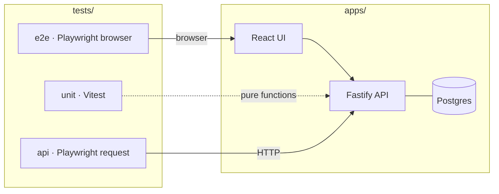

# expense-claims-e2e

> A reference-quality test automation project — Playwright + TypeScript against a
> purpose-built expense-claims app, with seeded bugs that prove the suite earns its keep.

[](https://github.com/rach16/expense-claims-e2e/actions/workflows/e2e-ci.yml)


**Status: 🚧 under construction — phase 1 of 12 complete.** The roadmap below is
honest about what exists today: skeleton, CI, and a fully test-first domain core
(the money suite was committed before the implementation — check the history).

---

## The idea

Most automation portfolios point tests at a demo site they don't control. This project
inverts that: it ships a **small app built to be tested** — controllable data,
injectable clock, deterministic auth — and a test suite that demonstrates the
decisions that actually matter in production automation:

- **Layered testing** — every scenario lives at the *fastest* layer that can observe
  its failure. No E2E test for anything an API test can see.
- **Seeded, feature-flagged bugs** — toggle `BUGS=IDOR_CLAIM_READ` and watch exactly
  the right tests fail. A detection matrix proves the suite catches what it claims to.
- **Parallel-safe isolation** — worker-scoped tenants, no shared golden data, no
  truncation between tests.
- **Flake as a first-class concern** — retries are instrumentation, not paint;
  explicit waits are lint errors.
- **Zero long-lived secrets** — CI generates its own credentials per run; cloud auth
  is OIDC-federated. Fork it and it's green.
- **Ephemeral cloud environments** — Terraform spins up a real AWS environment per
  smoke run and destroys it after. Total project cloud spend: under $1.

## Architecture



Tests never import app internals — they hit the app over HTTP like a real client.
The apps are npm workspaces; the test layers are outside consumers.

## Test strategy

| Layer | Runner | Owns | Budget |
|---|---|---|---|
| Unit | Vitest | Money math, state machine, validators | < 2s |
| API | Playwright `request` | CRUD, authz matrix, pagination, concurrency | ~60s |
| Contract | OpenAPI + oasdiff | Breaking-change detection, spec drift | ~15s |
| E2E | Playwright | 12–15 user journeys, nothing an API test can see | ~90s sharded |
| a11y | axe-core | Zero serious/critical per screen | ~10s |
| Smoke (deployed) | Playwright | Real infra, real TLS, ephemeral AWS env | ~3m |

## Getting started

```bash
nvm use               # Node 22+
npm ci                # exact lockfile install
npx playwright install chromium
npm test              # typecheck → unit → e2e, cheapest first
```

## Roadmap

- [x] **P0** — Repo skeleton: strict TS, Vitest, Playwright, CI pipeline
- [x] **P1** — Domain core: money, claim state machine, validators — 62 unit tests, 100% coverage, 90% floor enforced
- [x] **P2** — Fastify API + Postgres + generated OpenAPI spec *(claims endpoints land with auth in P3–P4)*
- [ ] **P2.5** — Docker: multi-stage image, compose, Trivy scan
- [ ] **P3** — Auth + fixture graph: worker tenants, role storage states
- [ ] **P4** — Full API suite: authz matrix, pagination, race conditions
- [ ] **P5** — React UI (4 screens), typed client generated from the spec
- [ ] **P6** — E2E journeys, axe accessibility checks
- [ ] **P7** — Seeded bug flags + detection matrix
- [ ] **P8** — CI hardening: sharding, report merging, Pages, quality gate
- [ ] **P9** — Docs: architecture, ADRs, triage runbook
- [ ] **P10** — Terraform: OIDC, ECR, ephemeral Fargate stack
- [ ] **P11** — Deploy-smoke workflow: apply → test → always destroy
- [ ] **P12** — Cost guardrails: janitor, budget alarm, scorched-earth script

## Design principles

1. **Tests touch nothing we don't control.** No external sites, no third-party APIs.
2. **A test creates exactly the data it asserts on.** Never reads another test's.
3. **The assertion is the wait.** Web-first assertions only; `waitForTimeout` is a lint error.
4. **Cheapest check first.** Locally and in CI: typecheck → unit → api → e2e.
5. **Green must be reproducible.** Lockfile replay, pinned browsers, one Node version source.

## License

MIT
