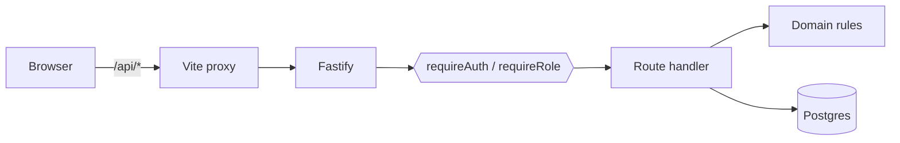
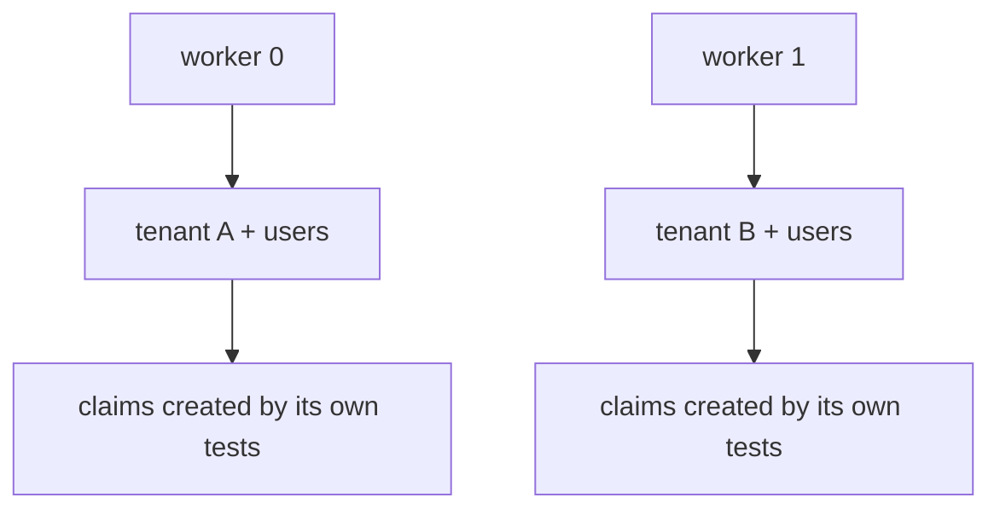
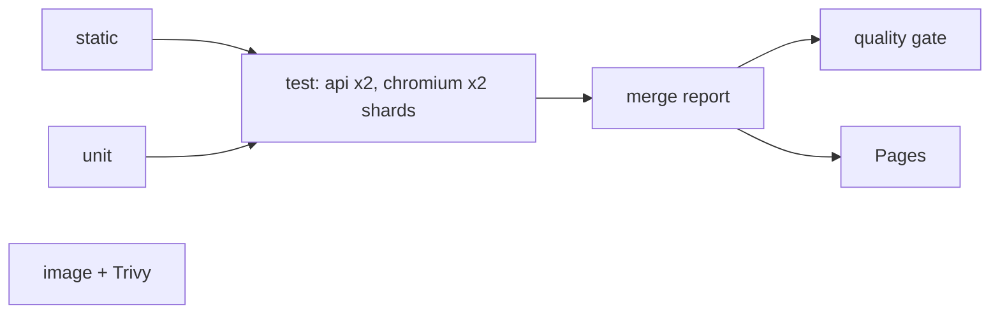

# Architecture

A reviewer's map of the repo: what each piece is, where it lives, and why it's
shaped that way. Start here, then follow the ADRs for individual decisions.

## Layout

```
apps/
  api/            Fastify + TypeBox + Drizzle (the app under test)
    src/domain/   pure business rules — money, state machine, validators
    src/routes/   HTTP handlers; they orchestrate, the domain decides
    src/auth/     argon2id hashing, JWT access tokens, rotating refresh tokens
    src/bugs.ts   seeded-defect registry (BUGS=…)
    drizzle/      generated, committed SQL migrations
    openapi/      generated, committed OpenAPI 3.1 spec — the contract
  web/            Vite + React UI
    src/api/      client generated from the spec (openapi-typescript/-fetch)
    src/bugs.ts   UI seeded-defect registry (VITE_BUGS=…)
tests/
  api/            Playwright `request` suites + the worker-scoped fixture graph
  e2e/            browser journeys, Page Objects, a11y, per-role storage states
scripts/
  detection-matrix.mjs   proves each seeded bug is caught by the right tests
  quality-gate.mjs       the single required CI check
```

Unit tests live *next to* the code they test (`apps/api/src/**/*.spec.ts`)
because they are white-box. Everything under `tests/` is black-box: it talks to
the app over HTTP exactly like a real client, and never imports app internals.

## Request path



Every route declares a TypeBox schema. One schema does three jobs: runtime
validation of requests *and* responses, static types for the handler, and
OpenAPI generation. Response validation also means the serializer only emits
declared fields — a handler that accidentally returns a user row cannot leak
`passwordHash`.

## Test layers

| Layer | Runner | Owns | Isolation |
|---|---|---|---|
| Unit | Vitest | money, transitions, validators | pure functions |
| API | Playwright `request` | CRUD, authz, pagination, concurrency | worker-scoped tenant |
| Contract | generated spec + CI diff | drift, breaking changes | n/a |
| E2E | Playwright browser | user journeys | fresh context + role storageState |
| a11y | axe-core | zero serious/critical | as above |

**Placement rule:** a scenario lives at the fastest layer that can observe its
failure. The seeded-bug matrix enforces this empirically — five of the seven
defects are caught without a browser.

## Parallel isolation



Every row is tenant-scoped, and each Playwright worker registers its own tenant
through the API at startup. Workers physically cannot see each other's data, so
`fullyParallel` needs no locks, no truncation, and no cleanup — and the tests
continuously exercise the same tenant-scoping the product relies on.

## Auth

- **Passwords:** argon2id. Unknown emails still burn a hash so login timing
  doesn't reveal which accounts exist.
- **Access token:** JWT, HS256, 5-minute TTL, carries `sub`, `tenantId`, `role`.
- **Refresh token:** random 256-bit value stored *hashed*, in an httpOnly
  SameSite=Strict cookie. Rotated on every use; replaying a consumed token is
  treated as theft and revokes the whole token family.
- **CI has no stored secrets:** each run generates its own JWT signing key and
  registers its own users.

## Seeded bugs

`BUGS=` (API) and `VITE_BUGS=` (UI) switch on one deliberate defect each.
`npm run test:matrix` boots the stack once per flag and asserts the expected
tests fail — and only those. See [seeded-bugs.md](seeded-bugs.md).

## CI



Cheap checks first and concurrent; the slow layer shards across runners; blob
reports merge into one HTML report published to GitHub Pages; a single quality
gate blocks on failures and excess flake. Nightly adds Firefox, WebKit, a mobile
viewport, the dependency audit, and the detection matrix.
