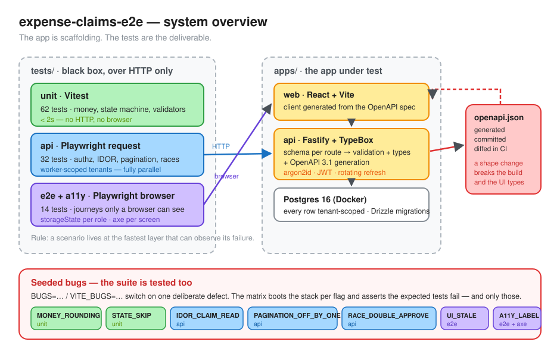
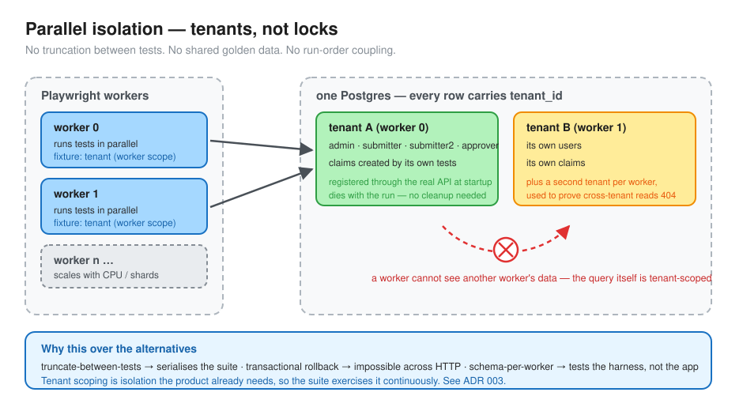
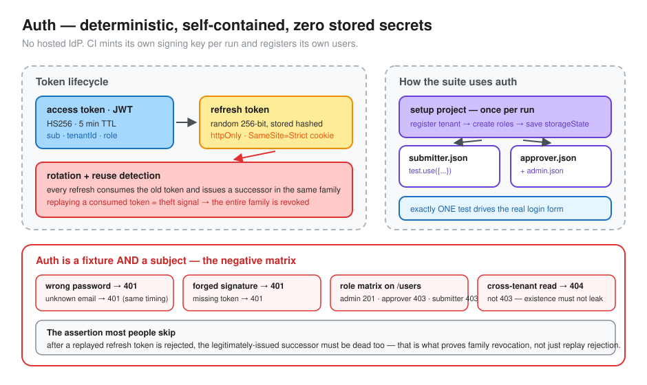
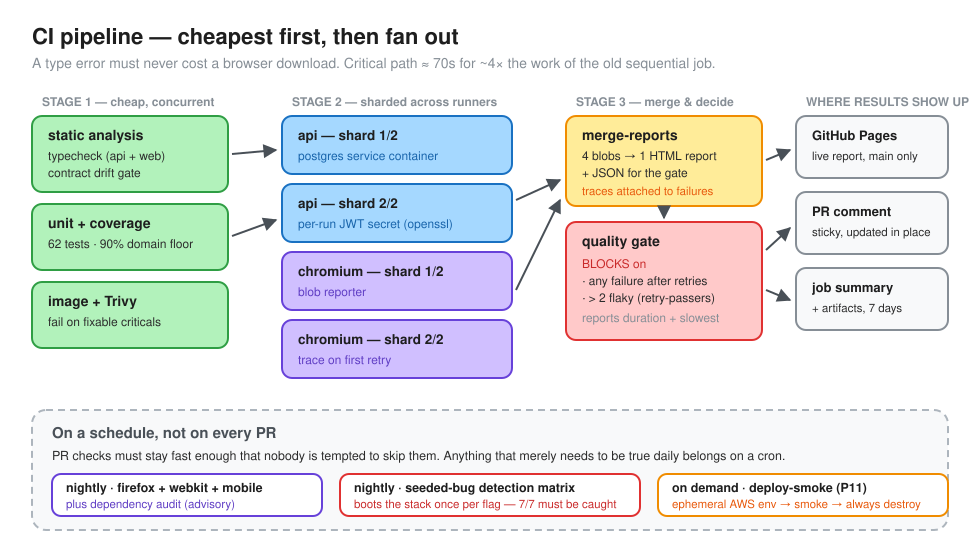

# Visual guide

The whole project in four pictures. If you only read one page of this repo,
read this one.

---

## 1. What this is

An expense-claims app exists here **only so the tests have something real to
test**: controllable data, a deterministic auth story, and defects that can be
switched on to prove the suite works.

The placement rule that drives everything: *a scenario lives at the fastest
layer that can observe its failure*. That's why five of the seven seeded bugs
are caught without ever starting a browser, and the browser layer owns only what
is invisible from the API — a rendering bug and an accessibility regression.

The red loop on the right is the contract: the OpenAPI spec is **generated** from
the same schemas that validate live traffic, **committed**, and **diffed in CI**.
A shape change fails the build and breaks the UI's types at the same time.

---

## 2. How it runs in parallel without stepping on itself

Isolation is a property of the **data model**, not of test ordering. Each worker
registers its own tenant through the real API at startup, and every row is
tenant-scoped — so `fullyParallel` needs no locks, no truncation, and no cleanup.

The bonus: because tests rely on the same tenant scoping the product relies on,
the suite exercises that boundary continuously. The cross-tenant read test asserts
**404, not 403** — even confirming a record exists would leak across tenants.

Rejected alternatives and why: truncation serialises the suite; transactional
rollback is impossible across HTTP; schema-per-worker tests the harness rather
than the app. ([ADR 003](adr/003-worker-scoped-tenants.md))

---

## 3. How auth works — and how it's tested

Auth is both **infrastructure and subject**. As infrastructure: sessions are
minted once per role through the API and reused as `storageState`, so tests start
authenticated and login flakiness can only ever fail one test. As subject: a
negative matrix covers wrong passwords, forged signatures, the role matrix, and
cross-tenant reads.

The assertion most implementations skip is the last one on the diagram — after a
replayed refresh token is rejected, the *legitimately issued successor* must be
dead too. That's what proves family revocation rather than mere replay rejection.

No hosted identity provider, and no stored secrets: **CI generates its own signing
key per run and registers its own users.**

---

## 4. How CI decides whether to trust a change

Cheap checks run first and concurrently; only then do sharded jobs pay for
browsers. Four shards produce four blob reports, merged into **one** HTML report
with traces attached to failures — published to GitHub Pages on `main`, posted as
a sticky PR comment, and summarised in the job panel.

One required check decides: **any failure after retries blocks; more than two
flaky tests block.** Retry-passers are reported as flaky rather than counted as
green, because a retry is instrumentation, not a fix. Duration trends are reported
but never block — [gates block only on actionable findings](adr/006-gate-on-actionable-only.md).

Anything that merely needs to be true daily — other browsers, mobile viewport,
dependency audit, the seeded-bug detection matrix — runs on a schedule, so PR
feedback stays fast enough that nobody is tempted to skip it.

---

## Where to go next

| | |
|---|---|
| The decisions, with what each one costs | [ADRs](adr/) |
| The seven seeded bugs and how to add one | [seeded-bugs.md](seeded-bugs.md) |
| What to do when the pipeline is red | [triage-runbook.md](triage-runbook.md) |
| File-level detail | [architecture.md](architecture.md) |
